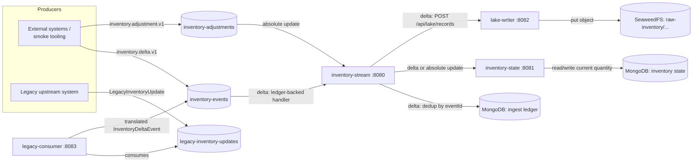

# Domain and Architecture Context

## Domain

The inventory event platform tracks on-hand quantity for every `(facilityId, sku)`
pair across a distributor's network of fulfillment facilities. Quantity never moves in isolation: it is always the
result of an event.

Two kinds of domain events exist today:

- **Delta event** (`inventory.delta.v1`) — a relative change to on-hand quantity, produced by things like shipments
  received, units picked for an order, or a point-of-sale sale. Carries a signed `quantityDelta`.
- **Adjustment event** (`inventory.adjustment.v1`) — an authoritative, absolute quantity correction for a
  `(facilityId, sku)`, produced by things like a cycle count or a manual correction. Carries an absolute `quantity`.

Both event kinds share a common envelope (`InventoryDomainEvent`, in
`event-contracts`): a stable `eventId` (UUID), the `sku`/`facilityId`
coordinates, an `eventTime` (the instant the event actually happened in the source system, in UTC), and a `sequence`
number that is monotonically increasing per `(facilityId, sku)`. The wire `type` name (`inventory.delta.v1`,
`inventory.adjustment.v1`) is part of the durable contract and never changes once published — new event kinds are added
as new type names rather than by mutating an existing one.

A separate, older format — `LegacyInventoryUpdate` — represents the same kind of relative change but originates from a
legacy upstream system with its own schema. It is translated into the canonical `InventoryDeltaEvent` shape before it
enters the rest of the platform.

## Event flow

All three Kafka topics are keyed with the canonical partitioning key
`facilityId:sku` (`InventoryKafkaKeys.forKey`/`forCoordinates` in
`event-contracts`), so every event for a given `(facilityId, sku)` lands in the same partition and is delivered to
consumers of that partition in the order it was produced.

## Modules

| Module             | Role                                                                                                                                                                                                                                                                                                                                                                            | Port |
|--------------------|---------------------------------------------------------------------------------------------------------------------------------------------------------------------------------------------------------------------------------------------------------------------------------------------------------------------------------------------------------------------------------|------|
| `event-contracts`  | Shared Kotlin library: domain event types, `InventoryKey`/`InventoryState`, update request/response types, and the canonical Kafka key helper. No runtime service.                                                                                                                                                                                                              | —    |
| `inventory-stream` | Ingestion and fan-out service. Consumes `inventory-events` and `inventory-adjustments`. Delta events follow a ledger-backed handler that calls both `inventory-state` and `lake-writer` and marks the `eventId` processed only after both effects complete. Adjustment events call `inventory-state` directly and use its own conditional idempotency and one-conflict refresh. | 8080 |
| `inventory-state`  | Authoritative current-quantity store. Exposes a plain HTTP API backed by MongoDB; applies delta/absolute updates with sequence and version guards (see [ADR-003](adr/003-state-update-semantics.md)).                                                                                                                                                                           | 8081 |
| `lake-writer`      | Raw event archive. Exposes an HTTP API that writes an immutable, date-partitioned JSON copy of each canonical event delivered to it to SeaweedFS's S3-compatible storage (see [ADR-001](adr/001-event-time.md), [ADR-002](adr/002-idempotent-sinks.md)).                                                                                                                        | 8082 |
| `legacy-consumer`  | Bridges the legacy upstream format. Consumes `legacy-inventory-updates`, translates each record into a canonical `InventoryDeltaEvent` via `LegacyEventTranslator`, and republishes it to `inventory-events` using the same `facilityId:sku` key.                                                                                                                               | 8083 |

## Contracts at a glance

- **Kafka topics**: `inventory-events`, `inventory-adjustments`, `legacy-inventory-updates`.
- **Kafka key**: `facilityId:sku`, built by `InventoryKafkaKeys` in `event-contracts` — every producer in the platform
  (including `legacy-consumer`) uses this helper rather than re-deriving the key.
- **HTTP APIs**:
    - `inventory-state`: `GET /api/inventory/{facilityId}/{sku}` (404 if the key has never been seen),
      `POST /api/inventory/delta`, `POST /api/inventory/absolute` — the latter two return
      `InventoryUpdateResponse { status: APPLIED | DUPLICATE | STALE | CONFLICT, state? }`.
    - `lake-writer`: `POST /api/lake/records` with a `LakeWriteRequest { event }`, returning
      `LakeWriteResponse { objectKey }`.
- **Health**: every service exposes Spring Boot Actuator health at `GET /actuator/health` on its own port.

## Guarantees this platform relies on

- **Ordering and replay stability** — a stable, deterministic Kafka key plus a per-key `sequence` guard means backfills
  and replays of the same events are safe to run more than once. See [ADR-003](adr/003-state-update-semantics.md).
- **Correct historical partitioning** — the lake is partitioned by the event's own UTC `eventTime`, not by when it
  happened to be written, so late-arriving and replayed events land in the historical partition they belong in. See
  [ADR-001](adr/001-event-time.md).
- **Safe retries against external systems** — writes to MongoDB and SeaweedFS are idempotent by design, so at-least-once
  delivery from Kafka (and from
  `inventory-stream`'s own retry behavior) never produces duplicate state changes or duplicate lake objects.
  See [ADR-002](adr/002-idempotent-sinks.md).
- **A deliberate, staged simplification path** — `inventory-state` is reached over HTTP from a Kafka-consuming handler
  today rather than consuming Kafka directly; that is a known intermediate state, not the end goal. See
  [docs/migrations/kafka-simplification.md](migrations/kafka-simplification.md)
  and [ADR-017](adr/004-external-sink-delivery.md).
